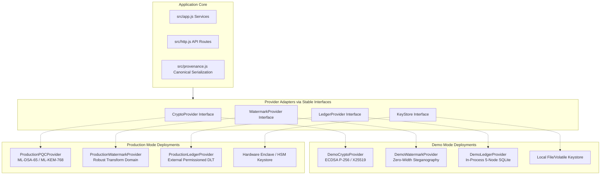

# Architecture: Dual-Mode Provenance & Attribution System (SIH26237)

"Demo Mode demonstrates the complete provenance workflow using locally deployable development providers. Production Mode uses the same application contracts with NIST-standardized PQ cryptography, secure key management, a production watermark implementation, and an organization-operated permissioned DLT."

---

## 1. High-Level Concept: One Application, Two Modes

The core provenance engine is invariant. Whether operating in **Demo Mode** or **Production Mode**, the application executes the identical end-to-end workflow:

```
Sender
  │ (Bulk AES-256-GCM + Per-Recipient Key Encapsulation)
  ▼
Distribute Document
  │
  ▼
Authorized Recipient Decrypts
  │ (Recovers CEK, Embeds Forensic Watermark)
  ▼
Create Canonical Decryption Record
  │ (Binds DocID, RecipientID, SessionID, WatermarkID, Timestamp)
  ▼
Recipient Digitally Signs Record
  │
  ▼
Commit to Tamper-Evident Ledger (Consensus / Quorum)
  │
  ▼
Deliver Forensically Distinct Representation
```

### Forensic Investigation:
```
Leaked Document
  ▼
Extract Watermark Identifier
  ▼
Query Immutable Ledger
  ▼
Verify Recipient Digital Signature
  ▼
Verify Validator Block Hash & Quorum Approvals
  ▼
Deterministic Attribution Verdict
```

---

## 2. Component Provider Boundaries

The application layer (`src/app.js`, `src/http.js`, `src/provenance.js`) does not couple to specific crypto algorithms, storage drivers, or watermark encodings. Instead, stable interface contracts isolate implementation dependencies:



---

## 3. Provider Specifications & Mode Matrix

| Component | Interface | Demo Provider | Production Provider |
|---|---|---|---|
| **Digital Signatures** | `CryptoProvider.sign` / `verify` | ECDSA P-256 / SHA-256 (Development Provider) | ML-DSA-65 (NIST FIPS 204 Standardized PQC) |
| **Key Establishment** | `CryptoProvider.encapsulate` / `decapsulate` | X25519 ECDH + HKDF-SHA256 (Development Provider) | ML-KEM-768 (NIST FIPS 203 Standardized PQC) |
| **Bulk Encryption** | `CryptoProvider.aeadEncrypt` / `aeadDecrypt` | AES-256-GCM (AAD bound to `doc:id:ver`) | AES-256-GCM (AAD bound to `doc:id:ver`) |
| **Watermarking** | `WatermarkProvider.embed` / `extract` | Text Zero-Width Steganography (`WM-[0-9A-F]{16}`) | Transform-Domain Robust Media Steganography |
| **Audit Layer** | `LedgerProvider.submit` / `view` | 5 In-Process SQLite Stores (3-of-5 Quorum) | Organization-Operated Permissioned DLT Network |
| **Key Sealing** | `KeyStore.seal` / `open` | AES-256-GCM under scrypt KEK | Hardware-backed Enclave / Client Smart Card |

---

## 4. Canonical Decryption Record (Platform Independent)

Both Demo and Production modes construct and verify identical canonical schema representations:

```json
{
  "authorizationId": "AUT-XXXXXXXX",
  "documentHash": "38b9...e21a",
  "documentId": "DOC-0001",
  "documentVersion": "1.0",
  "identityId": "CID-0192",
  "keyId": "KEY-0192-V1",
  "keyVersion": 1,
  "recipientId": "REC-0192",
  "sessionId": "SES-XXXXXXXX",
  "signatureAlgorithm": "ML-DSA-65",
  "timestamp": "2026-10-01T15:30:00.000Z",
  "watermarkId": "WM-XXXXXXXXXXXXXXXX"
}
```

The canonical record is serialized deterministically via order-independent recursive JSON (`src/util.js:canon`), preventing signature malleability across different runtimes and deployment targets.
